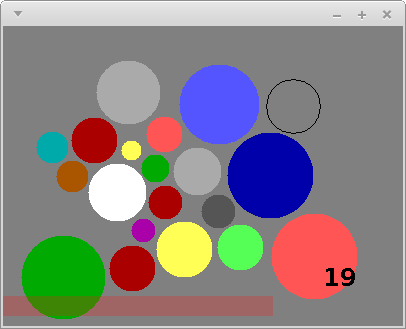
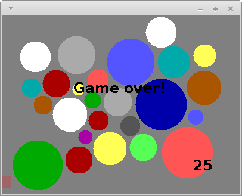

**Milestone 1 Due:** Friday, Sept 3rd by 11:59 PM

**Milestone 2 Due:** Thursday, Sept 16th by 11:59 PM

Acknowledgment: The idea for this assignment comes from [Tom Ellman](http://pages.vassar.edu/tomellman/) at Vassar College.

## Getting Started

Download [CS201\_Assign01\_Gradle.zip](CS201_Assign01_Gradle.zip). Copy and extract the zip file into your **CS201-Fall2021** directory. Import it into your **CS201-Fall2021** IntelliJ project using

> **File&rarr;New&rarr;Module from Existing Sources...**

Select the **CS201\_Assign01\_Gradle** directory and in the **Import Module** dialog select **Import module from external model&rarr;Gradle** and click **Finish**.

You should see a project called **CS201\_Assign01\_Gradle** in the Project window.

### Milestone 1

**There are only unit tests for Milestone 1 of this assignment.** Test the class implementation by running the unit tests by right-clicking on the file **DiskTest.java** in the **src/test/java/** directory, and then choosing

> **Run 'DiskTest'**

Or subsequently by selecting **DiskTest** from the dropdown list in the top right corner of the IDE and clicking the green arrow.

### Milestone 2

**There are unit tests for the first part of Milestone 2 of this assignment.** Test the class implementation by running the unit tests by right-clicking on the file **DiskModelTest.java** in the **src/test/java/** directory, and then choosing

> **Run 'DiskModelTest'**

Or subsequently by selecting **DiskModelTest** from the dropdown list in the top right corner of the IDE and clicking the green arrow.

For the second part of this milestone, run the program by right-clicking on the file **DisksApp.java** in the **src/main/java/** directory, and then choosing

> **Run 'DisksApp.main()'**

Or subsequently by selecting **DisksApp** from the dropdown list in the top right corner of the IDE and clicking the green arrow.

## Your Task

Your task is to complete your implementation of the Disk Placement game described below. Here is a screenshot of what the completed game will look like:

> 

The goal is to place disks of random sizes and colors onto the game board so that

1.  no disk overlaps any other disk, and
2.  every disk lies entirely within the rectangular game board

The solid disks are the ones that have been successfully placed. The black disk outline follows the mouse and shows where the next disk could be placed. The number in the lower right-hand corner shows the number of disks that have been successfully placed.  The pink bar at the bottom of the window is a bar showing how much time remains to place the current disk.

The game ends when a disk

* is placed in a position where it overlaps another disk,
* is not entirely placed within the game board, or
* is not placed before the countdown timer expires

When the game ends, a game over message should be displayed:

> 

You can download my implementation of the game to see how it works:

> [disks-obfuscated.jar](disks-obfuscated.jar)

On Windows systems, just double-click on the file. On Linux and MacOS, open a terminal window, change directory into the directory in which you saved the file, and run the command

    java -jar disks-obfuscated.jar

There are two milestones:

* Milestone 1: Complete the **Disk** class
* Milestone 2: Complete the **DiskModel** (model) and **DiskPanel** (view-controller) classes

Note that the bodies of some of the methods have the code


throw new UnsupportedOperationException("not implemented yet");


As you implement each method, simply remove this code.

### Disk class

An instance of the **Disk** class represents one of the disks placed on the game board. Each **Disk** object should store the **x** and **y** coordinates of the disk's center, a **radius**, and a color (represented as member of the **DiskColor** enumeration). You should add fields to the class for each of these 4 properties.

You must implement 7 methods:

-   A constructor which initializes the fields of a newly-created **Disk** object using values specified by parameter values
-   A **getX** method which returns the **Disk** object's center x coordinate value
-   A **getY** method which returns the **Disk** object's center y coordinate value
-   A **getRadius** which returns the **Disk** object's radius value
-   A **getColor** method which returns the **Disk** object's color
-   An **overlaps** method which determines whether or not the **Disk** object overlaps another **Disk** object passed as a parameter
-   An **isOutOfBounds** method which determines whether or not the **Disk** object partly or completely lies outside the bounds of the rectangular game board

Each method is described by a comment which explains, in detail, how the method should work.

#### Hints

The formula for computing the distance between two points is

> 

You can compute the square root of a **double** value using the **Math.sqrt** method.

### DiskModel class

An instance of the **DiskModel** class represents the **ArrayList** of **Disk** objects that have been placed on the board. You should add a field to the class for this list.

You must implement 4 methods:

-   A constructor that takes no parameters which initializes the empty **ArrayList** field
-   A **getDisks** method which returns the **ArrayList** object
-   A **getNumDisks** method which returns the number of **Disk**s currently stored in the **ArrayList**
-   An **addDisk** method which adds the **disk** parameter to the model's **ArrayList**

### DiskPanel class

An instance of the **DiskPanel** class represents the *controller* and *view* methods for the game. You should add fields to store a model as well as **x**, **y**, and **radius** for the current outline disk to be placed along with any other necessary fields to track the game state, e.g. a **boolean** flag for game over.

#### Constructor

The constructor should initialize all of the fields of **DisksPanel**.  This could include:

* initialize temporary x and y disk location fields and a random radius field
* allocate a **DiskModel**
* initialize the initial timeout duration and the amount of time remaining to place the current disk (these could be **int** fields)

#### Mouse events

The **handleMouseMove** controller method is called whenever the mouse pointer is moved within the window. You can get the x and y coordinates as follows:


int x = e.getX();
int y = e.getY();


where **e** is the parameter to the method, an instance of the **MouseEvent** class. This method should update the position coordinates of the outlined disk being placed.

The **handleMouseClick** controller method is called whenever a mouse button is clicked. You should use this method to place a disk in the window, i.e. *add* it to the model. You will need to check to ensure before adding it that the new disk

1.  does not overlap any previously placed disk, and
2.  is placed entirely within the bounds of the panel

The **WIDTH** and **HEIGHT** constants provide the width and height of the panel.

Remember that you will need to call **repaint** to force the contents of the panel to be redrawn when the game state changes.

#### Disk creation

Start the next outlined disk at the same location as the previously placed one. When the next disk (or the initial one) is being positioned by the user, its radius should be randomly chosen in the range 10..44, inclusive. You can generate random numbers using an instance of the **java.util.Random** class as a field:


private Random rand;


Create an instance in your constructor:


rand = new Random();


You can generate a random number uniformly chosen from the range 0..n-1, inclusive, using the method call


rand.nextInt(n)


#### Disk placement

When the user clicks the mouse, a new **Disk** object should be created using the current cursor position, radius, and random color (see step 6 below). The game will need to keep track of each disk that has been placed successfully *within the model*.

When a disk is placed successfully, a reference to the new **Disk** object should be added to the model using the **addDisk** method in the **DiskModel** class.

#### Timer events

The skeleton code for the **DisksPanel** class creates an instance of the **javax.swing.Timer** class and stores it in a field called **timer**.  It also sets up an event handler which calls the **handleTimerEvent** method when the timer fires.  The timer is configured to fire after a delay of 0.1 seconds.  So, you can think of one timer "tick" as being one tenth of a second.

You should use an **int** field to keep track of how many ticks the player has left to place the current disk.  Each time a timer event occurs, you should decrement this field.  If the value of the field reaches 0, then the game is over because the timeout expired.

When the game starts (i.e., in the **DisksPanel** constructor), you should call **timer.start()** to start the timer running.  By default, timer events will be generated repeatedly, so you don't need to restart the timer when a timer event occurs.

When a disk is placed successfully, you can call **timer.stop()** followed by **timer.start()** to make sure that the user receives the full amount of time to place the next disk.  Also, you should reset the field that keeps track of how many ticks the user has remaining to place the next disk.

For extra credit, you can make the game more challenging by decreasing the number of ticks available each time the user places a disk successfully.

#### Paint method

The **paint** (or **paintComponent**) method should use the fields representing the game state to render the current configuration.

Some **java.awt.Graphics** methods that will be useful:

-   **setColor** - Sets the drawing color.
-   **drawOval** - Draws an outlined oval. If the width and height are the same, draws an outlined circle.
-   **fillOval** - Draws a filled oval. If the width and height are the same, draws a filled circle.
-   **setFont** - Sets the current font used for drawing text.
-   **drawString** - Draws a string of text characters.

The **paintComponent** method should draw a circle (using the appropriate color) for each disk stored in the model. Note that the number of placed disks can be obtained using the **getNumDisks** method in the **DiskModel** class.

Note that because the **Disk** class uses **double** values to represent coordinates and dimensions, but the methods of **java.awt.Graphics** require **int** values, you will need to use type casts to convert from **double** values to **int** values.  For example, let's say that **x**, **y**, **w**, and **h** are the coordinates and width/height of a circle you want to draw.  The call to **fillOval** would be


g.fillOval((int) x, (int) y, (int) w, (int) h);


Also note that the x/y coordinates of a disk represent its *center*, but the x/y coordinates in a call to **fillOval** are the upper left corner of a rectangle surrounding the oval being drawn.  You will need to adjust the coordinates accordingly and determine the width/height of the bounding rectangle/square when drawing a disk.

You should draw the bar indicating how much time the user has left to place the next disk using a partially transparent color.  Colors can have an "alpha channel", which is a value between 0 and 255, where 255 is completely opaque and 0 is completely transparent.  In our solution, we used


Color barColor = new Color(255, 23, 23, 63);


as the bar color.

## Grading

**Milestone 1:**

* fields - 10%
* constructor - 15% 
* getX, getY, getRadius, getColor - 25%
* isOutOfBounds - 25%
* overlaps - 25%

**Milestone 2:**

* Model class - 15%
* Panel class fields - 5%
* Displaying the outline of the next disk to be placed - 15%
* Allowing disks to be placed (added to the model), drawing them - 20%
* Detecting overlap and out-of-bounds - 10%
* Keeping track of time remaining to place disk - 10%
* Displaying bar to indicate remaining time - 5%
* Keeping score, displaying score - 10%
* Detecting end of game, displaying "Game over" - 10%

Extra credit option:

-   Decreasing the timeout each time a disk is placed successfully - up to 5%

For both milestones, points may be deducted for poor coding style, including:

* Inconsistent indentation
* Cryptic variable names
* Non-private instance fields
* Initialization of fields outside the constructor
* Lack of comments

## Submitting

When you are done, submit the lab to the Marmoset server using the Terminal window in IntelliJ (click **Terminal** at the bottom left of the IDE). 

### Milestone 1

Navigate to the directory using

<pre>
$ <b>cd CS201_Assign01_Gradle</b>
CS201-Fall2021/CS201_Assign01_Gradle
$ <b>make submit_ms1</b>
</pre>

Enter your [Marmoset](https://cs.ycp.edu/marmoset) username and password, if successful you should see

<pre>
######################################################################
              >>>>>>>> Successful submission! <<<<<<<<<

Make sure that you log into the marmoset server to manually
check that the files you submitted are correct.

Details:

         Semester:   Fall 2021
         Course:     CS 201
         Assignment: assign01_ms1

######################################################################
</pre>

### Milestone 2

Navigate to the directory using

<pre>
$ <b>cd CS201_Assign01_Gradle</b>
CS201-Fall2021/CS201_Assign01_Gradle
$ <b>make submit_ms2</b>
</pre>

Enter your [Marmoset](https://cs.ycp.edu/marmoset) username and password, if successful you should see

<pre>
######################################################################
              >>>>>>>> Successful submission! <<<<<<<<<

Make sure that you log into the marmoset server to manually
check that the files you submitted are correct.

Details:

         Semester:   Fall 2021
         Course:     CS 201
         Assignment: assign01_ms2

######################################################################
</pre>

### After you submit

**Very important**: After you submit the assignment, please log into the [Marmoset server](https://cs.ycp.edu/marmoset) and check the files you submitted to make sure that they are correct.

*It is your responsibility to make sure that you have submitted your work correctly.*

## An Agile Approach to Developing the Disk Game Assignment

The code for this assignment, as provided, compiles and runs.  It doesn't do much - it only paints a grey board and it doesn't process any events - but it does run.  Let's take an agile programming approach to building this assignment.

One of the tenets of agile programming is to always have something running and then make small incremental changes, while maintaining a running application.  So, let's build this program in small steps, so that the code is always working - and each step adds a little bit more of the required functionality.

But first, you need to have a fundamental understanding of the problem - at a high level.  Can you describe what it is you are being asked to do - in your own words - without looking at the problem description?  Essentially, you need to first study the problem description, roll it the problem around in your head, and draw it on paper or on a white board, before trying to code it.  If you can't describe the problem to your friends, your family, or your classmates, then you don't have a fundamental understanding of the problem.

Here is what a description of the problem might look like:

: Create a game where colored disks of random sizes are placed on a board.  The game continues as long as the newly placed disk does not overlap with any of the other disks, and the new disk is completely inside the boundaries of the board, and the time allowed to place the disk has not run out.

And here are the details:

* As the mouse moves, display a black circle centered around the cursor.

* When the user clicks the mouse, if the circle overlaps any existing disks or is out-of-bounds, the game is over.  If not, place a disk of the same size as the circle centered on the location of the mouse click.  Give the disk a color from the DiskColor pallette.

* Generate a new circle of a random size, and repeat the above.

* Display the count of disks placed.

* Run a timer to limit how long the user has to place a disk. If the timer times out before the new disk is placed, the game is over.  Otherwise, restart the timer each time a disk is placed.

* Display a timer bar indicating how much time is left to place a disk.

* When the game is over, display "Game Over".

How should we approach implementing this program, with all of its details?  Here is a suggested order for implementation of the required features:

1. Get the **Disk** class implemented such that the unit tests pass.

1. Implement the **DiskModel** class to store a list of **Disk** objects such that the unit tests pass, then move on to the GUI.

1. Just paint a black circle centered around the mouse - a fixed size circle - don't worry about the details yet.  Verify that the mouse is centered inside the circle, and that the circle follows the mouse.  Don't move on to the next step until this step performs correctly.

1. Next, for a mouse click, just place a single **Disk** into the model and draw it on the board, with the current size of the circle, and with a fixed color.  Don't worry about random size, or color, or any of the other details - just keep track of a single disk, and paint it to the board.

1. Now add multiple **Disk**s to the model as the mouse is clicked.  Again, don't worry about any other details, like random size, color, out-of-bounds, or overlap. Paint all the **Disk**s to the board by retrieving them from the model and using a loop to draw each **Disk** in the list.  Note that all of the Disks will have the same size and color at this time.

1. Add in the RANDOM radius - when the mouse is clicked, create the new circle with a RANDOM radius (10 to 44) that follows the mouse.  Make sure that when each new Disk is added to the model, it has the same radius as the outlined circle did.

1. Now generate colors for the Disks.  These could be random, or follow a specific order through the DiskColor array.  The following code may look somewhat strange, but it returns the ith color directly from the DiskColor enum: 
    
        DiskColor newDiskColor = DiskColor.values()[i];
                
1. Add displaying the count of the Disks.

1. Now add the out-of-bounds test.  Where should that code be placed - before or after you put the **Disk** in the model?  Set a flag to indicate when an out-of-bounds condition occurs.

1. Now add the overlaps test.  Remember to check the new **Disk** being placed against all of the existing ones in the model.  Where does the code for that test go - before or after you put the **Disk** in the model?  Set a flag to indicate when an overlaps condition occurs.

1. Display "Game Over" when the game has ended. Consider how this condition can be detected. The game should no longer respond to events when this occurs.

1. Display the Timer bar.  Don't run the timer yet, just display the bar.

1. Stop and restart the timer on each mouse click.  Don't worry about keeping track of time, yet.

1. To keep track of time, count the number of timer events.  Timer events occur 0.1 seconds (100 ms) apart.

1. Reset the timer count each time a mouse click occurs.

1. Update the length of the timer bar to be proportional to the amout of time left before the timer runs out.

1. End the game when the timer reaches the time out value.    

The basic strategy is to work on one task at a time, and get that task working, before moving on to the next task.  Always get your code running correctly for the current task, first.

Attack the major tasks first: circle follows mouse, paint a Disk where the circle was when the mouse was clicked, keep track of all Disks in the model, etc...  First discover how each part works, and then add in the details.  Concentrate on one task at a time - small changes with frequent builds.

Make changes in the code to as few places as possible at any one time - compile and run often - see that your changes work.  Tweak them as necessary until they do.

Add fields as they become necessary - fields for the outline disk you are currently placing, a model to hold the placed **Disk**s, a timer count, an indication that the game is over.

One other important step - save your work frequently.  As you get each important piece working, archive your project so that you can return to a previous working state if you irreversibly break your code while adding in the next component.  You can repeatedly archive your project using different archive file names **or simply upload intermediate versions to Marmoset**.

