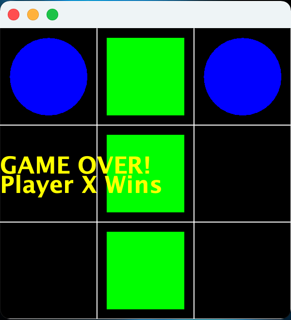

**Milestone 1 Due:** Sunday, Sept 26th by 11:59 PM

**Milestone 2 Due:** Tuesday, Oct 5th by 11:59 PM

## Getting Started

Download [CS201\_Assign02\_Gradle.zip](CS201_Assign02_Gradle.zip). Copy and extract the zip file into your **CS201-Fall2021** directory. Import it into your **CS201-Fall2021** IntelliJ project using

> **File&rarr;New&rarr;Module from Existing Sources...**

Select the **CS201\_Assign02\_Gradle** directory and in the **Import Module** dialog select **Import module from external model&rarr;Gradle** and click **Finish**.

You should see a project called **CS201\_Assign02\_Gradle** in the Project window.

### Milestone 1

**There are unit tests for Milestone 1 of this assignment.** Test the class implementations by running the unit tests by right-clicking on the file **TicTacToeModelTest.java** and **TicTacToeControllerTest.java** in the **src/test/java/** directory, and then choosing

> **Run 'TicTacToeModelTest'**

Or subsequently by selecting **TicTacToeModelTest**, etc. from the dropdown list in the top right corner of the IDE and clicking the green arrow.

You can also play a console based version of the game by running **TicTacToeConsole.java**.

### Milestone 2

Run the program by right-clicking on the file **TicTacToeGUI.java** in the **src/main/java/** directory, and then choosing

> **Run 'TicTacToeGUI.main()'**

Or subsequently by selecting **TicTacToeGUI** from the dropdown list in the top right corner of the IDE and clicking the green arrow.

## Your Task

In this assignment, you will complete the implementation of a Tic-Tac-Toe program that includes a GUI and the ability to load/save games. There will be two milestones:

-   Milestone 1: Implement the **TicTacToeModel** class and the **TicTacToeController** class methods (except for saving and loading games). This will allow you to play the game in the console via **TicTacToeConsole**.

-   Milestone 2: Complete the **TicTacToePanel** class which will provide a GUI interface for the game that can then be played via **TicTacToeGUI**. Also, implement the **TicTacToeController** save and load methods to allow for the current game to be saved or a previously saved game to be loaded from a file.

Note that the bodies of some of the methods have the code


throw new UnsupportedOperationException("not implemented yet");


As you implement each method, simply remove this code.

## Milestone 1

### TicTacToeModel class

The **TicTacToeModel** class should have fields to store an **int** representing which player's turn it is, and a 3x3 array of **int**s representing the board configuration. Each element of the array will contain one of three values

-   **EMPTY** - blank (empty) cell
-   **PLAYER_X** - if the cell contains an X
-   **PLAYER_O** - if the cell contains an O

Use the **EMPTY**, **PLAYER_X**, and **PLAYER_O** constants defined in the model class, **NOT** numerical values. 

For the model class, you must implement the following game logic methods:

* Constructor which takes *no parameters* that allocates the board array and starts the game with **PLAYER_X**.

> To allocate a 3x3 array of **int** values:


int[][] board = new int[3][3];


> The first dimension of the array is the row and the second dimension is the column of the board.  Each array element represents a location on the game board.
>
> Be sure to initialize the board array elements to **EMPTY**

* **public int getTurn()** - This method should return the current player.

* **public int[][] getBoard()** - This method should return the array representing the board.

* **public int getCell(int row, int col)** - This method should return the contents of the board at the given row and column location.

* **public void placeMarker(int row, int col)** - This method should place the current player's marker on the board at the specified row and column.

* **public void updateTurn()** - This method should switch the current player.

### TicTacToeController class

An instance of the **TicTacToeController** class will implement methods that take a **TicTacToeModel** object along with other parameters as needed to call the corresponding model class game logic methods. These include (**note:** the save and load game methods are for milestone 2):

* **public boolean makeMove(TicTacToeModel model, int player, int row, int col)** - This method should check that the move is legal and if so place the marker for the current player. A legal move is one in which the specified row and column are each in the range 0-2 (inclusive), that the board is empty at that position, and it is the turn for the  player trying to place a marker. The method should return **true** if the move is made, and **false** otherwise.
 
* **public boolean checkWin(TicTacToeModel model)** - This method should check if the *current player* has a winning configuration. Winning configurations consist of three pieces in a row along a row, column, or diagonal. The method should return **true** if the current player has a winning configuration, and **false** otherwise. 

* **public boolean checkDraw(TicTacToeModel model)** - This method should check if the current board has a draw configuration. A draw configuration is one in which there are no empty spaces on the board. The method should return **true** if the board has a draw configuration, and **false** otherwise. **Hint:** Consider what condition would indicate that there is *not* a draw.

* **public void changePlayer(TicTacToeModel model)** - This method should swap the current player. *Hint:* Consider using the **updateTurn()** method of the model object parameter.

## Milestone 2

### TicTacToePanel class

An instance of the **TicTacToePanel** class will implement event driven methods for a GUI version of tic-tac-toe. It will use the same model and controller classes as the console version, but obtain user input via mouse and keyboard events. These include:

* **private void handleMouseClick(MouseEvent e)** - This method will process a mouse click to determine which player is attempting to place a marker, and in which cell the player is attempting to place their marker. If the *left* mouse button is clicked (i.e. **MouseEvent.BUTTON1**), then **PLAYER_X** is attempting to place a marker. If the *right* mouse button is clicked (i.e. **MouseEvent.BUTTON3**), then **PLAYER_O** is attempting to place a marker. You will need to convert the screen coordinates to corresponding row/column indicies for the model before calling appropriate controller methods to determine if the player can make the move, and if so checking for a win or draw condition to end the game. If neither end game condition is met, then the turn should be updated in the model. Once an end game condition has occurred, no further markers should be allowed to be placed on the board. *Hint:* Don't forget to refresh the window via **repaint()**.

* **private void handleKeyTyped(KeyEvent e)** - This method will process key presses and should attempt to *save* the current game state if the 's' key is typed, or *load* the previous saved game if the 'l' key is typed. The method should print messages to the console indicating success/failure of these operations. *Hint:* Don't forget to refresh the window via **repaint()** if a previous game was successfully loaded.

* **public paint(Graphics g)** - This method should render the current board using *green squares* for **PLAYER_X** and *blue circles* for **PLAYER_O**. It should also render text once a win or draw state has occurred. Code has been provided to draw the grid lines. 

Note that the default board is 300x300 such that each cell is 100x100 pixels on the screen.

### TicTacToeController class, cont.

Add functionality to allow the current game state to be saved and loaded from a file. The format of the file should be human readable and represent the board using **X**, **O**, and space with three lines containing three characters per line. Following the board should be the marker of the player whos turn it is. For example, if the current board state is

<pre>
 O | X | O  
---|---|---
   | X |   
---|---|---
 X |   | O 
</pre>

with it being **X**'s turn, the file would contain

<pre>
OXO
 X 
X O
X
</pre>

**Note:** You will need to convert between the board values (**PLAYER\_X**, etc.) in the model and the characters **"X"**, etc. in the file. The path and filename has been provided.

Implement the following read and write controller methods:

* **public boolean readBoard(TicTacToeModel model)** - This method should read from the provided **saveGame** filename to set the elements of the board array by reading one character at a time from the file. The method should return **true** if the board is loaded successfully and **false** otherwise. It **must not** throw any exceptions, but must handle them within the method printing an appropriate message for whatever problem has occurred. **Note:** There are newline characters between each line in the file.

* **public boolean writeBoard(TicTacToeModel model)** - This method should save the current board to the **saveGame** filename. It should write each array element consecutively to the file. The method should return **true** if the board is saved successfully and **false** otherwise. It **must not** throw any exceptions, but must handle them within the method printing an appropriate message for whatever problem has occurred. **Note:** Be sure to add newline characters (**"\\n"**) between each line in the file.

## Example Console Session

Run the program by right-clicking on the file **TicTacToeConsole.java** in the **src/main/java/(default package)** package, and then choosing

> **Run As&rarr;Java Application**

Here is an example session (user input in **bold**):

<pre>
   |   |   
---|---|---
   |   |   
---|---|---
   |   |   

Player X's turn:
Enter row and column (0-2): <b>1</b> <b>1</b>

   |   |   
---|---|---
   | X |   
---|---|---
   |   |   

Player O's turn:
Enter row and column (0-2): <b>0</b> <b>0</b>

 O |   |   
---|---|---
   | X |   
---|---|---
   |   |   

Player X's turn:
Enter row and column (0-2): <b>4</b> <b>2</b>
Invalid move, try again

 O |   |   
---|---|---
   | X |   
---|---|---
   |   |   

Player X's turn:
Enter row and column (0-2): <b>0</b> <b>0</b> 
Invalid move, try again

 O |   |   
---|---|---
   | X |   
---|---|---
   |   |   

Player X's turn:
Enter row and column (0-2): <b>0</b>  <b>1</b>

 O | X |   
---|---|---
   | X |   
---|---|---
   |   |   

Player O's turn:
Enter row and column (0-2): <b>0</b> <b>2</b>

 O | X | O  
---|---|---
   | X |   
---|---|---
   |   |   

Player X's turn:
Enter row and column (0-2): <b>2</b> <b>1</b>

 O | X | O  
---|---|---
   | X |   
---|---|---
   | X |   
   
GAME OVER!
Player X wins!
Thanks for playing!
</pre>

## Example GUI

Here is an example screenshot for the GUI

> 

## Testing

In **src/test/java/(default package)** right-click on **TicTacToeTest.java** and choose **Run As...&rarr;JUnit Test**. This will run the JUnit tests for the **TicTacToeModel** class. If you have correctly implemented the **TicTacToeModel** class, you will see a green bar, indicating that all tests have succeeded. Note that it is important to get the constructor correct, otherwise the tests will likely fail even if the other methods are implemented correctly.

It is possible that the tests don't test every possible situation. You may wish to add your own tests!

## Grading

**Milestone 1:**

* **TicTacToeModel** class - 45%
	* Fields - 5%
    * Constructor - 10%
    * getTurn - 5% 
    * getBoard - 5%
    * getCell - 5%
    * placeMarker - 5%
    * updateTurn - 10%
* **TicTacToeController** class - 55%
    * makeMove - 15% 
    * checkWin - 20%
    * checkDraw - 15%
    * changePlayer - 5%

**Milestone 2:**

* **TicTacToePanel** class - 70%
    * handleMouseClick
        * calculate board indices - 10%
        * determine player - 5%
        * check win - 5%
        * check draw - 5%
        * switch player - 5%
        * refresh window - 5%
    * handleKeyTyped
        * save game - 5%
        * load game - 5%
        * refresh window - 5%
    * paint
        * draw markers - 10%
        * draw win message - 5%
        * draw draw message - 5%
* **TicTacToeController** class - 30%
    * readBoard - 15% 
    * writeBoard - 15%

For both milestones, points may be deducted for poor coding style, including:

* Inconsistent indentation
* Cryptic variable names
* Non-private instance fields
* Initialization of fields outside the constructor
* Lack of comments

## Submitting

When you are done, submit the lab to the Marmoset server using the Terminal window in IntelliJ (click **Terminal** at the bottom left of the IDE). 

### Milestone 1

Navigate to the directory using

<pre>
$ <b>cd CS201_Assign02_Gradle</b>
CS201-Fall2021/CS201_Assign02_Gradle
$ <b>make submit_ms1</b>
</pre>

Enter your [Marmoset](https://cs.ycp.edu/marmoset) username and password, if successful you should see

<pre>
######################################################################
              >>>>>>>> Successful submission! <<<<<<<<<

Make sure that you log into the marmoset server to manually
check that the files you submitted are correct.

Details:

         Semester:   Fall 2021
         Course:     CS 201
         Assignment: assign02_ms1

######################################################################
</pre>

### Milestone 2

Navigate to the directory using

<pre>
$ <b>cd CS201_Assign02_Gradle</b>
CS201-Fall2021/CS201_Assign02_Gradle
$ <b>make submit_ms2</b>
</pre>

Enter your [Marmoset](https://cs.ycp.edu/marmoset) username and password, if successful you should see

<pre>
######################################################################
              >>>>>>>> Successful submission! <<<<<<<<<

Make sure that you log into the marmoset server to manually
check that the files you submitted are correct.

Details:

         Semester:   Fall 2021
         Course:     CS 201
         Assignment: assign02_ms2

######################################################################
</pre>

### After you submit

**Very important**: After you submit the assignment, please log into the [Marmoset server](https://cs.ycp.edu/marmoset) and check the files you submitted to make sure that they are correct.

*It is your responsibility to make sure that you have submitted your work correctly.*

## An Agile Approach to Developing the Tic-Tac-Toe Game Assignment

Just like for the previous assignment, it will be *extremely* beneficial to tackle this one again with an agile approach. Consider working on one task at a time and frequently running/testing your code.

