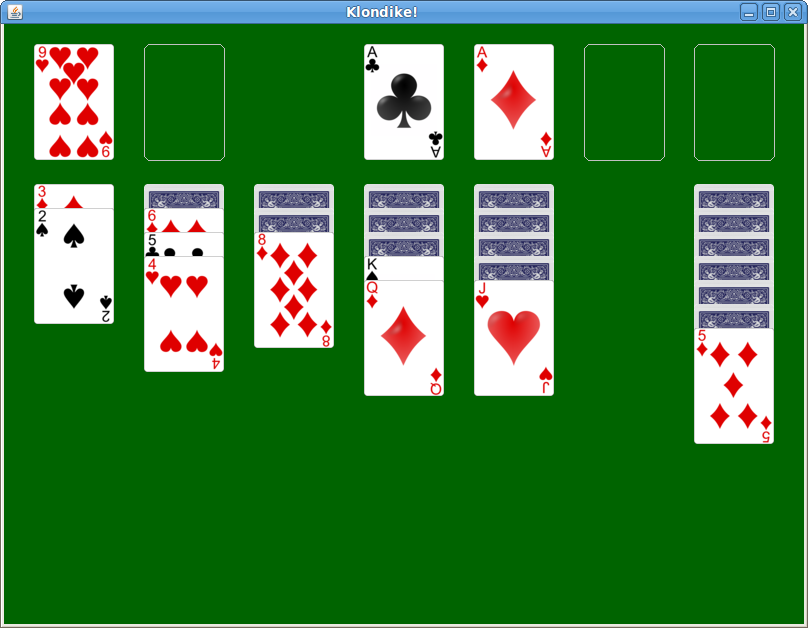

**Milestone 1 Due:** Friday, Oct 15th by 11:59 PM

**Milestone 2 Due:** Thursday, Oct 28th by 11:59 PM

## Getting Started

Download [CS201\_Assign03\_Gradle.zip](CS201_Assign03_Gradle.zip). Copy and extract the zip file into your **CS201-Fall2021** directory. Import it into your **CS201-Fall2021** IntelliJ project using

> **File&rarr;New&rarr;Module from Existing Sources...**

Select the **CS201\_Assign03\_Gradle** directory and in the **Import Module** dialog select **Import module from external model&rarr;Gradle** and click **Finish**.

You should see a project called **CS201\_Assign03\_Gradle** in the Project window.

 This is a substantial project. Do not wait until the last minute to start it! 

Note that there is an extra credit option: see the **Extra Credit** section under **Grading**.

### Milestone 1

**There are unit tests for Milestone 1 of this assignment.** Test the class implementations by running the unit tests by right-clicking on the file **PileTest.java**, **KlondikeModelTest.java**, and **SelectionTest.java** in the **src/test/java/** directory, and then choosing

> **Run 'PileTest'**

Or subsequently by selecting **PileTest**, etc. from the dropdown list in the top right corner of the IDE and clicking the green arrow.

### Milestone 2

**There are unit tests for Milestone 2 of this assignment.** Test the class implementation by running the unit tests by right-clicking on the file **KlondikeControllerTest.java** in the **src/test/java/** directory, and then choosing

> **Run 'KlondikeControllerTest'**

Or subsequently by selecting **KlondikeControllerTest** from the dropdown list in the top right corner of the IDE and clicking the green arrow.

## Your task

Your task is to implement classes that models the game of [Klondike Solitaire](http://en.wikipedia.org/wiki/Klondike_(solitaire\)).  A very complete set of JUnit tests is provided; if the tests pass, then you can have a high degree of confidence that your code is working correctly.

There are two milestones:

* Milestone 1: Complete the **Pile**, **KlondikeModel**, and **Selection** classes
* Milestone 2: Complete the **KlondikeController** class

Implementations of the **Rank** and **Suit** enumerations, and the **Card** class, are provided.  These are very similar to the ones you developed in [Lab 10](../labs/lab10.html) and [Lab 11](../labs/lab11.html).

A few other enumerations and classes are provided. The **Color** enumeration represents the color of a suit: you can call the **getColor** method on a **Suit** value to determine the suit's color (red or black.)  The **LocationType** enumeration represents the different types of locations in the game - **MAIN\_DECK**, **FOUNDATION\_PILE**, **TABLEAU\_PILE**, and **WASTE\_PILE**.  The **Location** class represents a location where a card (or cards) can be drawn from or moved to.

These are the classes you will need to complete:

* **Pile** &mdash; represents a pile of cards, similar to the **Deck** class from labs 10 and 11. **This class MUST use and ArrayList.**
* **KlondikeModel** &mdash; represents all of the different **Pile**s in the game
* **Selection** &mdash; a sequence of one or more cards taken from the main deck or a tableau pile as the first step in moving cards from one pile to another
* **KlondikeController** &mdash; handles all of the game logic and updates to the model

There are very detailed comments for each method you will need to implement.  You can also view the [API documentation](assign03javadoc/index.html) for the project.

The unit tests for **KlondikeController** are the most extensive and detailed tests, since they test the game logic.  Note that these tests use two saved game states.  You can view the image files `testgame.png` and `testgame2.png`, in the same directory as the test classes, to view these game states.

<b>Extremely important</b>: Do <i>not</i> change the name, visibility, return type, or parameter types of any of the methods in the classes you will be implementing.  We will use JUnit tests to test your implementation, and my tests will not work if you modify the API of these classes.  You are welcome to add additional methods: just don't change the existing ones.

## Rules of the game

You can see the rules of the game in action with the following demo: [klondike-obfuscated.jar](klondike-obfuscated.jar)

A game of Klondike consists of

-   the main deck, which is a pile of cards with the top card turned over
-   seven tableau piles of cards
-   four foundation piles of cards

A tableau pile consists of 0 or more hidden cards at the bottom of the pile. If a tableau pile is non-empty, then it has at least one exposed card on the top of the pile. A tableau pile may have more than one exposed card. Note that a tableau pile never contains a hidden card placed on top of an exposed card.

At the beginning of the game, the first tableau pile has one card, the second has two cards, etc.

A foundation pile contains cards of the same suit, arranged in order from Ace at the bottom of the pile to King at the top of the pile. (In Klondike, Aces are low.) There are four foundation piles, one for each suit.

On each turn, a player may either

-   draw another card from the main deck
-   move one or more cards

Drawing a card from the main deck means removing the current top card and placing it in a waste pile. The new top card on the main deck is then exposed. If the main deck is empty, then all of the cards are transferred from the waste pile back to the main deck. (Following the transfer of cards from the waste pile back to the main deck, they should appear in the order in which they originally occurred.)

Moving a card transfers one or more cards from either the main deck or a tableau pile to a tableau pile or a foundation pile. Moves must be done following the rules of the game, which are as follows:

-   Only the top card may be removed from the main deck.
-   Only an exposed card or cards may be moved. (Hidden cards may not be moved.)
-   The cards moved are placed on top of whatever pile they are moved to.
-   When multiple cards are moved (from a tableau pile), the cards cannot be removed from the "middle" of the pile. Instead, a chosen card and all cards on top of it must be moved.
-   The colors of the cards in a tableau pile must alternate red and black. Clubs and Spades are black suits, and Diamonds and Hearts are red suits.
-   When placing a card on top of a tableau pile, the rank of the placed card must be one less than the tableau pile's current top card
-   When a card or cards are moved onto an empty tableau pile, the new bottom card must be a King.

Following a move, the top card of the pile the card or cards were moved from is exposed (if the pile is not empty.)

## Hints

There is a **Color** enumeration to represent suit color, with two members, **Color.RED** and **Color.BLACK**.  You can call the **getColor** method on a **Suit** value to get the suit's color.  For example:


Suit s1 = ..., s2 = ...; // assume that s1 and s2 are Suit values

if (s1.getColor() == s2.getColor()) {
    // s1 and s2 have the same suit color
} else {
    // s1 and s2 have different suit colors
}


The rules for placing a card on a tableau or foundation pile involve comparing the rank of the placed card to the rank of the top card on the pile.  For example, to place a card on a tableau pile, its rank must be one less than the top card on the pile.  You can call the **ordinal** method on any enumeration value (including members of the **Rank** enumeration) to find out its position in the enumeration: the first member has ordinal value 0, the second has ordinal value 1, etc.  So, your code for placing a card on a tableau pile might look something like this:


Card topCard = ...;   // top card on a tableau pile
Card placeCard = ...; // card being placed on the tableau pile

Rank topCardRank = topCard.getRank();
Rank placeCardRank = placeCard.getRank();

if (placeCardRank.ordinal() == topCardRank.ordinal() - 1) {
    // card being placed has a rank one less than
    // the top card's rank
}


**DO NOT USE THE RETURN VALUE OF .compareTo() FOR RANKS OTHER THAN TO DETERMINE GREATER THAN, LESS THAN, OR EQUAL TO.**

## Grading

**Milestone 1:**

* Pile &ndash; 50%
* Selection &ndash; 25%
* KlondikeModel &ndash; 25%

**Milestone 2:**

* Initialization of game state &ndash; 10%
* Selecting cards &ndash; 15%
* Checking legality of moves &ndash; 30%
* Moving selected cards &ndash; 30%
* Canceling a selection (unselect) &ndash; 10%
* Checking win &ndash; 5%

For both milestones, points may be deducted for poor coding style, including:

* Inconsistent indentation
* Cryptic variable names
* Non-private instance fields
* Lack of comments

## Extra Credit

For up to 20 points extra credit on Milestone 2 (i.e., a maximum grade of up to 120/100), implement a GUI like the one linked in the "Rules of the game" section.  It should look something like this (click for larger image):

> 

A partial GUI implementation is given to you in **KlondikeView**.  If your classes are working correctly, it should show you an initial game state.  You will need to handle mouse events to allow the player to draw a card, move cards, etc.

<b>Important</b>: Make sure all of the unit tests pass before you start working on the GUI.  Also, make sure that your GUI code does not cause any of the unit tests to fail.  (Your GUI code should not require any changes to your problem domain classes.)

## Submitting

When you are done, submit the lab to the Marmoset server using the Terminal window in IntelliJ (click **Terminal** at the bottom left of the IDE). 

### Milestone 1

Navigate to the directory using

<pre>
$ <b>cd CS201_Assign03_Gradle</b>
CS201-Fall2021/CS201_Assign03_Gradle
$ <b>make submit_ms1</b>
</pre>

Enter your [Marmoset](https://cs.ycp.edu/marmoset) username and password, if successful you should see

<pre>
######################################################################
              >>>>>>>> Successful submission! <<<<<<<<<

Make sure that you log into the marmoset server to manually
check that the files you submitted are correct.

Details:

         Semester:   Fall 2021
         Course:     CS 201
         Assignment: assign03_ms1

######################################################################
</pre>

### Milestone 2

Navigate to the directory using

<pre>
$ <b>cd CS201_Assign03_Gradle</b>
CS201-Fall2021/CS201_Assign03_Gradle
$ <b>make submit_ms2</b>
</pre>

Enter your [Marmoset](https://cs.ycp.edu/marmoset) username and password, if successful you should see

<pre>
######################################################################
              >>>>>>>> Successful submission! <<<<<<<<<

Make sure that you log into the marmoset server to manually
check that the files you submitted are correct.

Details:

         Semester:   Fall 2021
         Course:     CS 201
         Assignment: assign03_ms2

######################################################################
</pre>

### After you submit

**Very important**: After you submit the assignment, please log into the [Marmoset server](https://cs.ycp.edu/marmoset) and check the files you submitted to make sure that they are correct.

*It is your responsibility to make sure that you have submitted your work correctly.*

## An Agile Approach to Developing the Klondike Game Assignment

Just like for the previous assignments, it will be *extremely* beneficial to tackle this one again with an agile approach. Consider working on one task at a time and frequently testing your code to get one method working before moving on to the next. This assignment, particularly the controller, has methods that depend on each other, so it is **critical** to develop incrementally.

