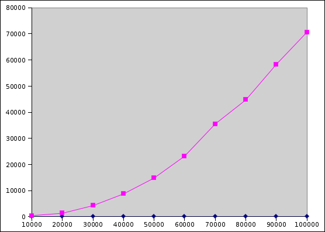

## Getting Started

Download [CS201\_Lab17\_Gradle.zip](CS201_Lab17_Gradle.zip). Copy and extract the zip file into your **CS201-Fall2021** directory. Import it into your **CS201-Fall2021** IntelliJ project using

> **File&rarr;New&rarr;Module from Existing Sources...**

Select the **CS201\_Lab17\_Gradle** directory and in the **Import Module** dialog select **Import module from external model&rarr;Gradle** and click **Finish**.

You should see a project called **CS201\_Lab17\_Gradle** in the Project window.

**There is a test class for Part 1 of this lab.** Run the unit tests by right-clicking on the file **ReverseTest.java** in the **src/test/java/** directory, and then choosing

> **Run 'ReverseTest'**

Or subsequently by selecting **ReverseTest** from the dropdown list in the top right corner of the IDE and clicking the green arrow.

Run the program for Part 2 of this lab by right-clicking on the file **Benchmark.java** in the **src/main/java/** directory, and then choosing

> **Run 'Benchmark.main()'**

Or subsequently by selecting **Benchmark** from the dropdown list in the top right corner of the IDE and clicking the green arrow.

## Your Task

### Part 1 - Reversing a List using get and set

Implement the method called **reverseUsingGetAndSet** in the **Reverse** class. This method should reverse the elements of the **List&lt;E&gt;** object passed as the parameter by calling the **get(int)** and **set(int, E)** methods. A possible algorithm is suggested in the comment inside the method.

### Part 2 - Benchmark List reversal for ArrayList and LinkedList

Once the **reverseUsingGetAndSet** method is implemented, write a benchmark program which measures how long the reversal takes for both **ArrayList&lt;E&gt;** and **LinkedList&lt;E&gt;** objects with 10,000, 20,000, 30,000, etc. elements, up to and including 100,000 elements.

Add your benchmarking code to the **Benchmark** class. The **main** method is already partly implemented. You can call the **createArrayList** and **createLinkedList** methods to create array lists and linked lists with a specified number of elements.

Output each data point in the format

> numElements,arrayListTime,linkedListTime

where times are measured in milliseconds. (See the description for [Lab 13](lab13.html) for how to measure the execution time of a chunk of code. Don't forget to call the **System.gc()** method before starting the timing, to avoid including garbage-collection overhead in your measurement.)

You should see output something like the following:

    10000,12,442
    20000,0,1352
    30000,1,4270
    40000,1,8759
    50000,2,14825
    60000,2,23214
    70000,3,35525
    80000,2,44721
    90000,2,58349
    100000,4,70634

Note that it will probably take a few minutes for the entire benchmark to complete.

Once you have collected your data, plot it in Excel. Your plot should look something like this:

> 

Copy your Excel file into the Eclipse project. (Put it in the subdirectory of your Eclipse workspace called **CS201\_Lab17**, and in Eclipse right-click on the project and choose **Refresh**.)

## Submitting

When you are done, submit the lab to the Marmoset server using the Terminal window in IntelliJ (click **Terminal** at the bottom left of the IDE). Navigate to the directory using

<pre>
$ <b>cd CS201_Lab17_Gradle</b>
CS201-Fall2021/CS201_Lab17_Gradle
$ <b>make submit</b>
</pre>

Enter your [Marmoset](https://cs.ycp.edu/marmoset) username and password, if successful you should see

<pre>
######################################################################
              >>>>>>>> Successful submission! <<<<<<<<<

Make sure that you log into the marmoset server to manually
check that the files you submitted are correct.

Details:

         Semester:   Fall 2021
         Course:     CS 201
         Assignment: lab17

######################################################################
</pre>
