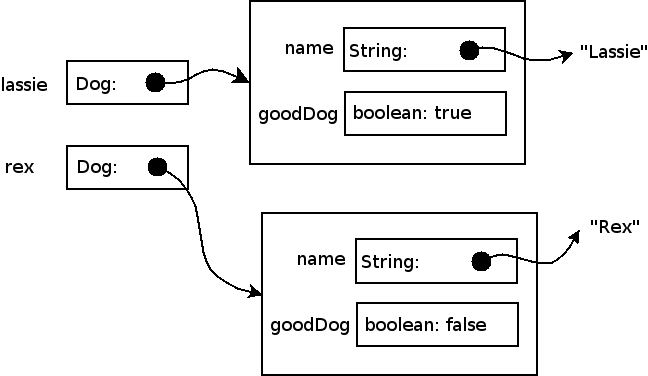
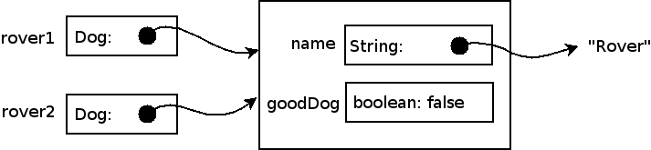

<!--
Note: The [course notes on objects, arrays, and references](../notes/objectsArraysReferences.html) will be useful.
-->

## Classes and Objects

As discussed in [Lecture 1](lecture01.html) a *class* is simply a *user-defined* datatype. The *class definition* will include the *fields* (variables) and *methods* (functions) that the class contains. Every *object* is an instantiation, or instance, of a *class*.  Each object will contain its own versions of the fields defined for the class.

### Fields and Constructors

The fields of class store the *state* of the object. Each field is a *local variable* within the object and thus has a corresponding datatype and name. A class also generally defines one or more *constructors* which define how new instances of the class are created.  A constructor generally *initializes* each field of a new object with a value, often by assigning the corresponding field to the value of one of the constructor's parameters.  Note that if a parameter has the same name as a field, then you must write "this.*fieldname*" to refer to the field within the method - otherwise, the parameter takes precedence.

The important things to understand about constructors are

-   the name of a constructor method is the same as the name of the class
-   constructor methods have no return type
-   argument values passed when the **new** operator is called - are passed as parameters to the constructor method
-   within a constructor method, **this** (the reference to the instance) is the newly-created object whose fields are being initialized by the constructor
-   constructors cannot be called except when instantiating a new object

### Getter and Setter Methods

Rather than allow users to access the fields of an object directly, we can control access using *getter* and *setter* methods. Getter methods allow the value of fields to be visible to the user, while setter methods allow the user to change the value of a field. When defining a class, you are not required to provide getter or setter methods.

If getter methods are not provided, then the state of the object is *unobservable*, since a user will not be able to access the values of the fields to obtain the current state of the object.

If setter methods are not provided, then the object is *immutable*, meaning that once the object is created (and the fields initialized in the constructor) they can never be changed.

### Instance Methods

Finally, classes will typically contain *instance methods* which define the operations an object supports often to adjust the fields (state) of the object. These methods are similar to C functions in that they may contain parameters and return a value (or reference). In addition to any parameters, the methods may use any of the fields directly. Note that if a parameter has the same name as a field, then you must write "this.*fieldname*" to refer to the field within the method -  otherwise, the parameter takes precedence.

This is the "Zen" of object-oriented programming:

> find an object, call a method on it.

### Example

From a design standpoint, an object represents some *entity* in the *problem domain*.  For example, let's say the problem domain is a children's game where some of the characters are dogs.  You could write a class called "Dog", where instances of this class would represent particular dogs in the game. The two fields in the Dog class represent the dog's name, and whether or not the dog is a good dog. We've also defined a single constructor that takes two parameters (a String and a boolean) and uses them to initialize the two fields of the object. There are also getter, setter, and instance methods included in the definition.


/**
 * A simple Java class representing a Dog.
 * Note: the name of the file must match the name of the class
 * i.e. Dog.java
 */
public class Dog {
    //
    // Fields (states) for Dog objects - should be private
    //
    private String name;
    private boolean goodDog;

    //
    // Constructor for Dog objects - should initialize fields
    //
    public Dog(String name, boolean goodDog) {
        this.name = name;
        this.goodDog = goodDog;
    }

    //
    // Getter method - returns the value of a field
    //
    public boolean isGoodDog() {
        return goodDog;
    }

    //
    // Setter method - allows field values to be changed
    //
    public void giveNewName(String newName) {
        name = newName;
    }

    //
    // Instance methods - determine what objects of a class can do
    //
    public void bark() {
        System.out.println(name + " barks");
    }

    public void respondToCall(String nameCalled) {
        // Good dogs come when their name is called
        if (name.equals(nameCalled) && goodDog) {
            System.out.println(name + " comes");
        } else {
            System.out.println(name + " does not respond");
        }
    }

    public void train() {
        goodDog = true;
    }
}


### Objects and References

The class definition defines a new *user-defined datatype* (similar to a C *struct*). To create an *object* (i.e. *allocate memory*), we use the **new** command along with calling a constructor method to *instantiate* an object. We then associate the object with a *reference* (similar to a C *pointer*) that has the same datatype as the objects' class.

As an example, we can create two Dog objects and assign them to the references **lassie** and **rex**:


Dog lassie = new Dog("Lassie", true);
Dog rex = new Dog("Rex", false);


Recall that each field of an object is a memory cell, and so are local variables.  Here is what memory will look like once the objects have been created:

> 

In Java, the only way to access an object or array is through a *reference*.  When you declare a local variable, field, or method parameter which has a class or array type, what you are really doing is defining a variable that can hold a *reference* to that kind of class or array.

The important thing to understand about references is that assigning one reference to another does **not** copy the object, it simply adjusts the object the reference is pointing to.  For example:


Dog rover1, rover2;
rover1 = new Dog("Rover", false);
rover2 = rover1; // Only the reference is copied, not the object!


After this code is executed, both references point to the same object:

> 

We can see this clearly by modifying the object through one reference, and observing the change is reflected in the other reference.


rover1.respondToCall("Rover"); // "Rover does not respond"
rover2.respondToCall("Rover"); // "Rover does not respond"
// rover1 and rover2 both point to the same object, so any
// changes we make to the object are reflected by both references
rover1.train();
rover1.respondToCall("Rover"); // "Rover comes"
rover2.respondToCall("Rover"); // "Rover comes"


The equality and inequality operators ("==" and "!=") are defined for references.  These will tell you whether or not two references point to the same object.  However, they will **not** tell you anything about the contents of the objects (or arrays) themselves!  This can be seen from the following code:


Dog spot = new Dog("Spot", true);
Dog anotherSpot = new Dog("Spot", true);
if (spot == anotherSpot) {
    System.out.println("same");
} else {
    System.out.println("different");
}


The code above prints "different", because "spot" and "anotherSpot" are two different objects, even though the contents of those objects are exactly the same.

To compare the contents of two objects to see if they are the same, you should use the equals method, as seen in the definition of the "respondToCall" method.  Using "==" or "!=" to compare objects instead of the equals method is a very common bug in Java programs, even for experienced programmers.

#### Null

The special reference *null* represents the absence of any object or array.  Basically, it means "points to nothing".  If you try to use a null value---for example, by invoking a method on it---a **NullPointerException** will be thrown, typically this only happens if you have a bug in your program.

## Encapsulation

While fields in Java can be defined as **public** - meaning they can be directly accessed by a user of an object - this can make our code very fragile. If we ever need to change the fields in the class -adding a field, removing a field, changing the type of a field, etc. - we could potentially break anyone's code that uses our class. Reducing the impact of code changes becomes very important when we write larger programs. 

Thus an important concept in object-oriented programming is *encapsulation* which precludes direct access to the fields outside of the class. We can enforce encapsulation by defining all fields as **private**, i.e. they can only be accessed by methods within the class. This provides us complete control of the accessing and updating of fields to only the constructor and any **public** methods including getters, setters, and instance methods we choose to define. By utilizing encapsulation, we can modify the class definition in any fashion as long as we do not change the *public* methods, i.e. the **API**.

**Properly encapsulated code is also easier to understand because all operations on a user-defined data type are performed by calling methods.**

Summary
=======

Here are some of the important things you should now know:

-   a *class* is a used-defined data type, much like a struct type in C
-   classes contain *fields*, *constructors*, and *methods*
-   an *object* is an instance of a class
-   objects are accessed by *references*; a variable whose type is a class stores a reference to an object
-   two variables may contain references to the same object
-   if **p** and **q** are variables whose type is a class, then the assignment **p = q** makes **p** point to the same object that **q** points to
-   we can enforce *encapsulation* by making all fields **private** and providing *getter* and *setter* methods as desired

