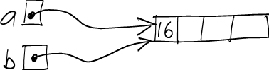
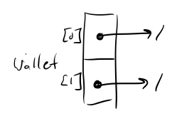
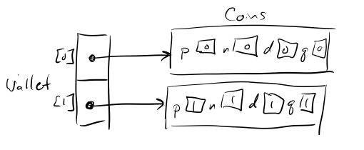

Note: see the [course notes on arrays](notes/javaArrays.html) for more detailed information about arrays in Java.

## Java Arrays

Java arrays are a lot like C/C++ arrays.

The main difference is that Java arrays are *objects*, in the same way that instances of classes are objects. As with all objects in Java, instances of array are accessed through references. Thus, an array variable in Java is *not* the actual array: it is just a reference to an array. Thus we denote the datatype of a reference to an array using the datatype and empty []. Then we allocate the array in a similar fashion to other objects using the **new** command with specifying the number of elements the array should contain. **Note:** Like arrays in C, once an array is created, it's size is fixed.

Consider the following code to declare a reference to an **int[]**, i.e. an "array of ints", and then allocate the array to contain 6 elements:


int[] heaps;                 // (1)
heaps = new int[6];          // (2)


While line (1) creates a variable called **heaps** whose type is **int[]**, since it is only a reference to an array, and not the array itself, the variable is simply **null** at this point, i.e. it does not refer to an actual array.

Line (2) allocates the array object for storing 6 **int** elements, and assigns the reference to **heaps**. Here's a picture:

> 

Like arrays in C and C++, Java arrays are indexed starting at 0. So, the valid range of indices for this array is 0..5.

Because arrays are accessed through references, it is possible to have two array variables storing references to the same array object. For example:


int[] a;
int[] b;

a = new int[4];
b = a;

a[0] = 15;

// (1)

System.out.println(b[0]); // prints 15

a[0] = 16;

// (2)

System.out.println(b[0]); // prints 16


As a picture, here's what's happening at point (1):

> 

Here's what's happening at point (2):

> 

**Note:** This is also how arrays are passed into methods as parameters, the parameter refers to the same array object as the argument in the method call. Also, unlike in C, since array variables are references they can be *returned* from a method, i.e. methods can have array return types.

### Array length

One nice feature of Java that is not present in C and C++ is the ability to determine the exact number of elements in an array. If *arr* is an array, then


arr.length


is the number of elements *that were allocated* for the array when it was *created*.

For example, the following static method will concatinate the elements of any array of **String** values:


public static String concat(String[] arr) {
  String s == "";

  for (i = 0; i < arr.length; i++) {
    s += arr[i];
  }

  return s;
}


This feature means we do not need to pass the length of the array to methods that take arrays as parameters, but may wish to pass a value indicating the number of *valid* array elements if only a portion of the array is being used.

### Default values

When an array object is created using the **new** operator, each element of the array is automatically initialized with a *default value*. The default value is 0 for all numeric element types, and the special *null* reference for all class and array element types.

Here's a code snippet that illustrates the default value for an array of **int** values:


int[] t = new int[4];
System.out.println(t[0]);  // guaranteed to print 0


### Arrays of references

When an array has a class or array type as its element type, it stores references which are initially **null**. Thus after allocating the array, each element must also be allocated using one of the class's constructors. Otherwise, the array elements are the same as any other kind of variable, i.e. once an element is obtained using an index we can call any of the methods on the object.

For example:


Coins[] wallet = new Coins[2];

// (1)

coins[0] = new Coins(0,0,0,0);
coins[1] = new Coins(1,1,1,1);

// (2)

for (int i = 0; i < wallet.length; i++) {
  System.out.println("Coins " + i + ": " + wallet[i].findCentsValue());
}


Here's what things look like at point (1):

> 

Note that the actual array objects have not been instantiated, only the references have been created (and initialized to **null** by default).

At point (2) we have allocated the objects and assigned the array element references to them which looks like:

> 

### Out-of-Bounds access

One important concern in C/C++ when dealing with arrays is that we need to be careful about accessing elements out-of-bounds (which may manifest itself in a variety of ways including continued execution of the program with data corruption). Since Java arrays contain a **.length** field, Java is able to detect invalid indices at runtime and throw an **ArrayAccessOutOfBounds** exception which typically will terminate the program (we will discuss handling exceptions later in the course). Thus we can never inadvertently access a Java array element with an invalid index.

## (Quick Introduction to) ArrayLists

While arrays in Java are a bit "safer" than arrays in C/C++, they still have many of the same limitations including having a fixed size once allocated. Alternatively, Java provides a set of **Collection** classes (which we will cover later in the course) that mimic arrays but with much more functionality. One such **Collection** class is known as an **ArrayList** (in the java.util package) which can be thought of as a dynamically resizing array. Thus the object will grow/shrink according to the number of objects stored in he collection.

For example, let's say that you're writing a program to keep track of your friends' email addresses. You could represent the email addresses as strings, and use an **ArrayList** to store them:


ArrayList<String> emailList = new ArrayList<String>();


Note that when declaring an **ArrayList** variable or creating a new **ArrayList** object, you must specify what type of objects the array list will contain. This type is called the *element type*.

To add strings to the list, call the **add** method:


emailList.add("jane_smith@yahoo.com");
emailList.add("sally.jones@gmail.com");
emailList.add("ben456@evilhacker.com");


Each object added to the list is appended onto the end of the sequence of objects.

The **size** method returns an integer value specifying the number of objects currently in the list. The **get** method allows you to retrieve the object at a specified index, where 0 is the first object in the sequence, 1 is the second object, etc:


// print all email addresses
for (int i = 0; i < emailList.size(); i++) {
    String email = emailList.get(i);
    System.out.println(email);
}


The **set** method takes an integer index and a reference to an object, and replaces the object at that index with the specified object. For example, if Jane Smith changes her email address, we could update our list as follows:


String oldEmail = "jane_smith@yahoo.com";
String newEmail = "jane_smith@us.ibm.com";
for (int i = 0; i < emailList.size(); i++) {
    String email = emailList.get(i);
    if (email.equals(oldEmail)) {
        emailList.set(i, newEmail);
    }
}


Note that we used the **equals** method to check whether an email address string was the same as Jane's previous email address. We will discuss the **equals** method in [Lecture 9](lecture09.html).

Removing objects from a collection
----------------------------------

Sometimes, you might need to remove some number of objects from a collection. The easiest and safest way to accomplish this task is to use a temporary collection object to store the objects you want to remove, and then use the **removeAll** method to remove them from the main collection.

For example, you might be concerned that email coming from the "evilhacker.com" site contains viruses. You could purge all addresses from this site from your email list as follows:


ArrayList<String> toRemove = new ArrayList<String>();

for (int i = 0; i < emailList.size(); i++) {
    String email = emailList.get(i);
    if (email.endsWith("@evilhacker.com")) {
        // mark this address for removal
        toRemove.add(email);
    }
}

emailList.removeAll(toRemove);


Summary
=======

-   Java arrays are really *objects* that are accessed by references, just like objects that are instances of a class
-   The **length** property of an array indicates how many elements an array object has
-   Array elements are automatically initialized to a *default value*, which is 0 for numeric types and **null** for reference types (classes and arrays)
-   ArrayLists are similar to arrays but dynamically adjust to the number of elements stored in the collection, which can be retrieved using the **size** method.
-   *add* is used to insert new elements into an ArrayList and it is best to use the **removeAll** method to safely remove elements from an ArrayList
