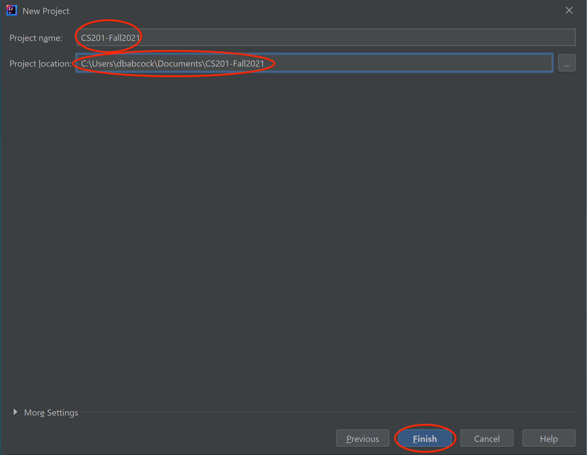
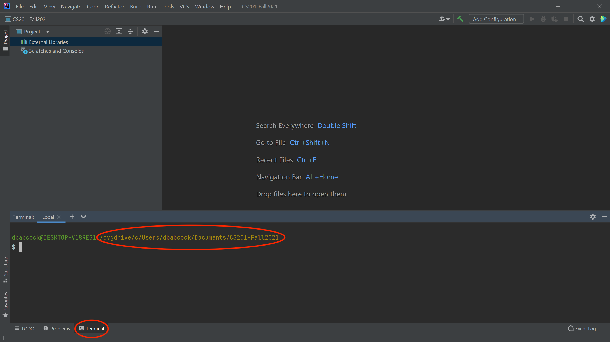

This page has links to useful resources for the course.

## Java and IntelliJ

All of the software we are using is open source (free). I encourage you to download it to install on your own computer.

-   [Java Development Kit](https://www.oracle.com/java/technologies/javase-downloads.html): This is required to run Java programs. Make sure you download the JDK appropriate for your operating system, e.g. **macOS Installer** or **Windows x64 Installer**.
-   [IntelliJ IDEA](https://www.jetbrains.com/idea/): This is the Java development environment we are using in class. It has a number of versions, but the free **Community** edition is sufficient for this course.

## Initial Setup

Once you have installed the Java JDK and IntelliJ, start IntelliJ which should open a welcome window

> 

Select **New Project** which will open the new project dialog

> 

Select **Empty Project** from the list on the left and click **Next**. Change the **Project name:** to **CS201-Fall2021** and select the **Project location:** to be the location where you want to keep all your CS201 projects, e.g. **C:/Documents** or **~/Documents/CS201**, and click **Finish**.

> 

Simply click **Ok** in the **Project Structure** dialog. This will create the root directory for all our CS201 projects.

## Setting up a Terminal application

All labs, assignments, and exams will be submitted to the [Marmoset submission server](https://cs.ycp.edu/marmoset) through the IntelliJ IDEA Terminal. This may require some additional installations depending on your operating system.

### Windows 10

We will be using [Cygwin](http://cygwin.com/) as our terminal program. 

Make sure you have first installed IntelliJ and set up your CS201-Fall2021 project as described above. If you already installed Cygwin for CS101, skip to step 2.

1. Install [Cygwin](http://cygwin.com/) and the various packages as described in the [CS101 Cygwin installation guide](https://ycpcs.github.io/cs101-spring2021/installCygwin.html).

2. Open IntelliJ and the CS201-Fall2021 project, then select **File -> Settings** from the menubar.

    

3. In the **Settings** dialog, select the **Tools->Terminal** option, then replace what is in the **Shell path:** setting with

    <pre>
    "C:\cygwin64\bin\sh" -lic 'cd "${OLDPWD-.}"; bash'
    </pre>

    

4. If everything is configured correctly, when you select the **Terminal** tab in the lower left corner of IntelliJ, it should open up a terminal pane that displays a Cygwin prompt in the **CS201-Fall2021** project directory.

    

### Mac OSX

1. From the Mac App store, download and install XCode. Run the application which will complete the installation process. **Note:** If you have a new M1-based Mac, you will also need to install Rosetta as part of installing XCode.

2. Open the **Terminal** application from the launchpad (it may be in the **Other** folder) and install the command line tools using

	```cpp
	$ sudo xcode-select --install
	``` 

### Submitting to Marmoset

All labs, assignments, and exams will be submitted to the [Marmoset submission server](https://cs.ycp.edu/marmoset) through the IntelliJ IDEA Terminal. To open the Terminal, at the bottom of the IntelliJ window click the **Terminal** menu item which should open the Terminal in the lower IDE pane. Navigate into the proper folder and type 

```cpp
$ make submit
```

then enter your Marmoset username and password and verify that the submission was successful.

### Terminal commands

A few useful terminal commands are

> -   **ls** - list the files/directories in the current location
> -   **cd ..** - change directory to the parent directory of the current location
> -   **cd** *[directory]* - change directory to the child directory named *[directory]*
